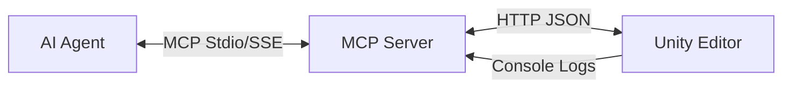

# UnityVibeBridge

## Concept: Mechanistic Vibe Coding

**UnityVibeBridge** bridges the gap between AI agents and the Unity Editor, specifically optimized for VRChat avatar creation (Vibe Coding). Instead of generating fragile C# scripts, it exposes a **Mechanistic Interface**—a set of deterministic tools to query state, inspect assets, and perform non-destructive modifications.

### Core Architecture



1.  **AI Agent (Director)**: Issues high-level intents via MCP tool calls.
2.  **MCP Server (Translator)**: Python FastAPI/FastMCP server that translates agent calls into Unity HTTP requests.
3.  **Unity Editor (Rigger)**: C# `InitializeOnLoad` server hook (`VibeBridgeServer.cs`). Executes operations using `AssetDatabase`, `Undo`, and Reflection.

## Completed Features (Phase 3 Hardened)

### 1. Safety & Stability (The Iron Box)
*   **Zero-Latency Heartbeat**: Domain reloads are detected via piggybacked response headers (`X-Vibe-Session`), invalidating stale InstanceIDs without extra network calls.
*   **Implicit Transactions**: The bridge automatically wraps mutations in atomic `Undo` groups. Every AI action is a single, clean Undo step in Unity.
*   **Provenance Tagging**: Every object created by the AI is session-tagged.
*   **Destruction Safety**: The `destroy_object` tool mechanically protects master files by refusing to delete any object created outside the current session.
*   **IP Hardening**: Strict local-only binding (`127.0.0.1`) ensures zero external attack surface.
*   **Capability Discovery**: Tools to check if an object is static, a prefab, or valid for specific operations.
*   **Fail Fast**: Unity console logs and exceptions are streamed back to the agent for immediate feedback.

### 2. Deep Inspection
*   **Hierarchy & Components**: Detailed dumps of scene structure and object state.
*   **Asset Inspection**: Peek inside prefabs and material shader properties without instantiating them.
*   **Render Summary**: Lightweight visual verification (renderer counts, material lists, bounds).

### 3. Precise Manipulation
*   **Transforms**: Set position, rotation, and scale locally or globally.
*   **Component Editing**: Read and write public fields/properties via reflection.
*   **Asset Management**: Find, instantiate, and reparent assets safely.

## Key Principles (The AI Safety Manual)
See [AI_ENGINEERING_CONSTRAINTS.md](AI_ENGINEERING_CONSTRAINTS.md) for the full list.
*   **Read-Before-Write**: Always `Inspect → Validate → Mutate → Verify`.
*   **Idempotence**: Every operation must be safe to repeat.
*   **Zero Trust**: All AI mutations are strictly boxed and logged.
*   **No Hidden Side Effects**: No file writes outside whitelist, no arbitrary C# execution.

### 🎨 Technical Artist Tools
The bridge includes a suite of tools for professional avatar optimization and world building:
*   **VRAM Auditing**: `calculate_vram_footprint` finds "PC Hidden Killers" (massive textures).
*   **One-Click Quest Bake**: `swap_to_quest_shaders` and `crush_textures` automate the mobile transition.
*   **PhysBone Ranking**: `rank_physbone_importance` intelligently prunes bones to meet Quest limits.
*   **Bake Guard**: `validate_bake_readiness` and `set_static_flags` ensure world assets are correctly configured for lightmapping.
*   **Non-Destructive**: `create_optimization_variant` creates copies so your master files stay safe.

### 🧹 Organizational Purity
All agent outputs are neatly sorted to prevent root directory clutter:
*   `captures/`: Timestamped screenshots and visual test history.
*   `metadata/`: Discovery logs and semantic object registries.
*   `optimizations/`: Output from automated optimization runs.
*   `HUMAN_ONLY/`: A sanctuary folder for human notes that is **mechanically invisible** to AI.

## Installation & Security

### 🚀 One-Click Bootstrap
If you point the agent to a new project, it can "self-install" the bridge:
```bash
goose run -t "bootstrap the VibeBridge into /path/to/my/project"
```

### 🛡️ Recommended: The "Iron Box" Sandbox

For maximum safety, run the agent in an isolated Docker sandbox. This prevents the agent from seeing your personal files (SSH keys, documents) and restricts it to your project folder.


1.  **Build & Launch**:

    ```bash

    ./start_sandbox.sh

    ```

    *Note: Requires Docker. Automatically builds the Goose CLI and sets up the Python environment.*


### 🔐 The Security Gate

Every code modification and shell command is audited by `security_gate.py` using AST logic analysis.

*   **Automatic Blocking**: Malicious imports, external network calls, and unsafe file paths are blocked silently.

*   **Human Trust**: If a high-risk operation is necessary, you must manually authorize it:

    ```bash

    python3 security_gate.py <file_path> --trust

    ```


### Manual Setup (On-the-Metal)

1.  **Unity**: Copy `unity-package/Scripts/VibeBridgeServer.cs` to your `Assets` folder.

2.  **Dependencies**: `pip install -r mcp-server/requirements.txt`.

3.  **Run**: `python mcp-server/server.py`.
