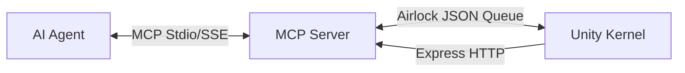

# UnityVibeBridge: The Governed Creation Kernel

## 🧠 Understanding Your AI "Co-Pilot"

### ⚙️ Demystifying the Magic: High-Fidelity Simulation
Large Language Models (LLMs) are **Probability Engines** that have become exceptionally good at **simulating aspects of sentience**. They don't "know" facts or feel emotions; they predict the next most likely sequence of tokens based on patterns in their training data.

In the context of Unity, the AI is not "visualizing" your Scene in a mind's eye. It is calculating the most statistically probable set of commands that align with your natural language intent.

### 🏷️ The Implied Sentience Trap (Combating AI Psychosis)
It is easy to fall into "magical thinking" when an AI responds with human-like warmth or technical authority. However, treating the AI as a sentient being can lead to **AI Psychosis**: a state where the user forgets the AI is a simulation and begins to trust its hallucinations as objective truth.

### ⚔️ Combatting Overconfidence: Adversarial Prompting
Use **Adversarial Prompting**. Ask the AI: *"I think this new logic is perfect. Now, I want you to act as a cynical auditor. Find 3 ways this could fail, crash Unity, or corrupt my Asset Database."*

### 🧩 The Cognitive Gap
Humans have a mental map of reality (e.g., you know that **Shoes are on Feet**). An AI does not "see" your Unity Scene; it only sees data patterns and names. 

**UnityVibeBridge is designed to cure this drift by providing:**
1. **Numerical Telemetry**: Replacing "imagined" scenes with hard vertex counts and coordinates.
2. **Epistemic Reconciliation**: Forcing the AI to prove its assumptions against the actual Unity state via `audit_avatar`.
3. **Kernel Governance**: Ensuring that even if the AI "hallucinates" a dangerous intent, the system mechanically prevents the damage via the **Kernel Guard**.

---

## Concept: Mechanistic Vibe Coding

**UnityVibeBridge** bridges the gap between AI agents and the Unity Editor. Instead of generating fragile C# scripts, it exposes a **Mechanistic Interface**—a set of deterministic tools to query state, inspect assets, and perform non-destructive modifications.

### Core Architecture

1.  **AI Agent (Director)**: Issues high-level intents via MCP tool calls.
2.  **MCP Server (Translator)**: Python server that translates agent calls into Unity requests.
3.  **Unity Editor (Rigger)**: `VibeBridgeKernel.cs` executes operations using `Undo` and Reflection.

## Completed Features (Kernel v1.1 Hardened)

### 1. Safety & Stability (The Iron Box)
*   **Main-Thread Time Budgeting**: The Kernel processes requests in 5ms slices, ensuring Unity remains at 60+ FPS even during heavy AI automation.
*   **Zero-Latency Status**: Domain reloads are detected via `metadata/vibe_status.json`. The AI monitors `state` to prevent command poisoning.
*   **Machine-Readable Diagnostics**: Unity streams structured console errors via `_vibe_warning` in the response JSON.
*   **Implicit Transactions**: All mutations are wrapped in atomic `Undo` groups. One AI request = One Undo step.

### 2. Deep Inspection & Precise Manipulation
*   **Read-Before-Write**: Always `Inspect → Validate → Mutate → Verify`.
*   **Stealth Framing**: `select_object` is focus-aware. It won't hijack the camera if the human is actively working in the Scene View unless `frame=true` is passed.
*   **Component Discovery**: `system/find-by-component` allows finding functional targets (e.g. all PhysBones) without hierarchy traversal.
*   **Batch Operations**: Rename, Reparent, and Delete in bulk for professional efficiency.

### 🎨 Technical Artist Tools (Standard Payload)
*   **VRAM Auditing**: `calculate_vram_footprint` finds "PC Hidden Killers" (massive textures).
*   **One-Click Quest Bake**: `swap_to_quest_shaders` and `crush_textures` automate the mobile transition.
*   **Physics Audit**: `run_physics_audit` identifies all Rigidbodies and Colliders for optimization.

### 🧹 Organizational Purity
All agent outputs are neatly sorted to prevent root directory clutter:
*   `captures/`: Timestamped screenshots and visual test history.
*   `metadata/`: Discovery logs and semantic object registries.
*   `optimizations/`: Output from automated optimization runs.
*   `HUMAN_ONLY/`: A sanctuary folder for human notes that is **mechanically invisible** to AI.

## Installation & Security

### 🚀 One-Click Bootstrap
If you point the agent to a new project, it can "self-install" the bridge:
`bootstrap_vibe_bridge(project_path="/path/to/project")`

### 🛡️ Recommended: The "Iron Box" Sandbox
For maximum safety, run the agent in an isolated Docker sandbox. This prevents the agent from seeing your personal files and restricts it to your project folder.

### 🔐 The Security Gate
Every code modification and shell command is audited by `security_gate.py` using AST logic analysis.
*   **Automatic Blocking**: Malicious imports and external network calls are blocked silently.
*   **Human Trust**: High-risk operations must be manually authorized.
