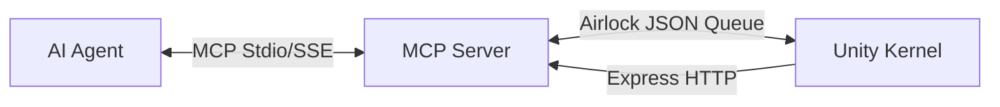

# UnityVibeBridge: The Governed Creation Kernel

## 🏛️ Technical Architecture
UnityVibeBridge transforms the Unity Editor into a deterministic Control Plane. It allows AI agents to interact safely with Unity's core engine via a mechanistic interface.

### Core Architecture

1.  **AI Agent (Director)**: Issues high-level intents via MCP tool calls.
2.  **MCP Server (Translator)**: Python server that translates agent calls into Unity requests.
3.  **Unity Editor (Rigger)**: `VibeBridgeKernel.cs` executes operations using `Undo` and Reflection.

### The "Director" Workflow
Agents must follow a strict execution lifecycle to ensure state integrity:
1. **Discover**: `get_hierarchy` / `search_objects` -> Build scene map.
2. **Verify**: `inspect_object` -> Prove assumptions about components.
3. **Protect**: `begin_transaction` -> Create an undo safety net.
4. **Execute**: `rename` / `set_value` / `clone` -> Perform the mutation.
5. **Observe**: Check `_vibe_warning` in the response for project errors.
6. **Finalize**: `commit_transaction`.

### Core Safety Layers
1. **The Kernel Guard**: Mechanically blocks mutations during **Compilation**, **Play Mode**, or **Asset Import**.
2. **Time-Budgeted IPC**: Requests are processed in 5ms slices to maintain 60+ FPS in the Unity Editor.
3. **Iron Box Security**: All mutations are registered with the `Undo` system and authenticated via `X-Vibe-Token`.

---

## 📘 Further Reading
- For instructions on how to manage AI behavior and prevent hallucinations, see [AI_PHILOSOPHY.md](AI_PHILOSOPHY.md).
- For strict engineering rules, see [AI_ENGINEERING_CONSTRAINTS.md](AI_ENGINEERING_CONSTRAINTS.md).

## Completed Features (Kernel v1.1 Hardened)

### 1. Safety & Stability (The Iron Box)
*   **Main-Thread Time Budgeting**: The Kernel processes requests in 5ms slices, ensuring Unity remains at 60+ FPS even during heavy AI automation.
*   **Zero-Latency Status**: Domain reloads are detected via `metadata/vibe_status.json`. The AI monitors `state` to prevent command poisoning.
*   **Machine-Readable Diagnostics**: Unity streams structured console errors via `_vibe_warning` in the response JSON.
*   **Implicit Transactions**: All mutations are wrapped in atomic `Undo` groups. One AI request = One Undo step.

### 2. Deep Inspection & Precise Manipulation
*   **Read-Before-Write**: Always `Inspect → Validate → Mutate → Verify`.
*   **Stealth Framing**: `select_object` is focus-aware. It won't hijack the camera if the human is actively working in the Scene View unless `frame=true` is passed.
*   **Component Discovery**: `system/find-by-component` allows finding functional targets (e.g. all PhysBones) without hierarchy traversal.
*   **Batch Operations**: Rename, Reparent, and Delete in bulk for professional efficiency.

### 🎨 Technical Artist Tools (Standard Payload)
*   **VRAM Auditing**: `calculate_vram_footprint` finds "PC Hidden Killers" (massive textures).
*   **One-Click Quest Bake**: `swap_to_quest_shaders` and `crush_textures` automate the mobile transition.
*   **Physics Audit**: `run_physics_audit` identifies all Rigidbodies and Colliders for optimization.

### 🧹 Organizational Purity
All agent outputs are neatly sorted to prevent root directory clutter:
*   `captures/`: Timestamped screenshots and visual test history.
*   `metadata/`: Discovery logs and semantic object registries.
*   `optimizations/`: Output from automated optimization runs.
*   `HUMAN_ONLY/`: A sanctuary folder for human notes that is **mechanically invisible** to AI.

## Installation & Security

### 🚀 One-Click Bootstrap
If you point the agent to a new project, it can "self-install" the bridge:
`bootstrap_vibe_bridge(project_path="/path/to/project")`

### 🛡️ Recommended: The "Iron Box" Sandbox
For maximum safety, run the agent in an isolated Docker sandbox. This prevents the agent from seeing your personal files and restricts it to your project folder.

### 🔐 The Security Gate
Every code modification and shell command is audited by `security_gate.py` using AST logic analysis.
*   **Automatic Blocking**: Malicious imports and external network calls are blocked silently.
*   **Human Trust**: High-risk operations must be manually authorized.
