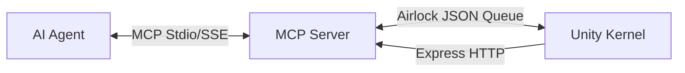

# UnityVibeBridge: The Governed Creation Kernel

## 🏛️ Technical Architecture
UnityVibeBridge transforms the Unity Editor into a deterministic Control Plane. It allows AI agents to interact safely with Unity's core engine via a mechanistic interface.

### Core Architecture

1.  **AI Agent (Director)**: Issues high-level intents via MCP tool calls.
2.  **MCP Server (Translator)**: Python server that translates agent calls into Unity requests.
3.  **Unity Editor (Rigger)**: `VibeBridgeKernel.cs` executes operations using `Undo` and Reflection.

### The "Director" Workflow
Agents must follow a strict execution lifecycle to ensure state integrity:
1. **Discover**: `get_hierarchy` / `search_objects` -> Build scene map.
2. **Verify**: `inspect_object` -> Prove assumptions about components.
3. **Protect**: `begin_transaction` -> Create an undo safety net.
4. **Execute**: `rename` / `set_value` / `clone` -> Perform the mutation.
5. **Observe**: Check `_vibe_warning` in the response for project errors.
6. **Finalize**: `commit_transaction`.

### Core Safety Layers
1. **The Kernel Guard**: Mechanically blocks mutations during **Compilation**, **Play Mode**, or **Asset Import**. Check `metadata/vibe_status.json` before any mutation.
2. **Iron Box Protocol**: Every mutation MUST be wrapped in `begin_transaction` and `commit_transaction`. All AI actions are single, clean Undo steps in Unity.
3. **Time-Budgeted IPC**: Requests are processed in 5ms slices to maintain 60+ FPS in the Unity Editor.
4. **Token Security**: All mutations are authenticated via `X-Vibe-Token`.

---

## 🛠️ Unified Tool Inventory

### 1. 🧠 Epistemic & Cognitive Governance
*   **`inspect_object`**: Returns detailed components, tags, and transform state.
*   **`get_telemetry_errors`**: Streams last 50 console errors for truth reconciliation.
*   **`list_available_tools`**: Dynamic discovery of Payload capabilities.

### 2. 🛡️ Kernel & Integrity
*   **`transaction_begin` / `commit` / `abort`**: Atomic Undo-Group management.
*   **`system/execute-recipe`**: Atomic multi-tool batch execution.
*   **`system/veto` / `unveto`**: Mechanical human kill-switch (Emergency Stop).
*   **guard/status**: Checks for unsafe states (Compiling, Playing).

### 3. 🏗️ Scene Manipulation
*   **`get_hierarchy`**: Recursive Scene graph mapping.
*   **`system/search`**: Regex & Layer-based discovery.
*   **`object/set-value`**: Generic reflection-based property mutation (Supports Vector3, Color).
*   **`rename_object` / `reparent_object`**: Identity and hierarchy mutations.
*   **`clone_object` / `delete_object`**: Lifecycle management.
*   **`select_object`**: Focus-aware selection (Stealth framing).

### 4. 🎨 Technical Art & Optimization
*   **`material/list`**: Lists material slots on an object.
*   **`material/inspect-properties`**: Returns all shader properties for a slot.
*   **`material/set-color` / `set-texture`**: High-fidelity slot mutations.
*   **`material/set-float` / `toggle-keyword`**: Granular shader control.
*   **`material/batch-replace`**: Replaces materials across multiple targets.
*   **`material/snapshot` / `restore`**: Persistent material state management.
*   **`vram_footprint`**: Numerical GPU memory audit of textures.
*   **`texture_crush`**: Batch max-size reduction for optimization.
*   **`swap_to_quest_shaders`**: Automated mobile material transition.
*   **`opt/fork`**: Non-destructive material and asset isolation.

### 5. 🔬 Auditing & Intelligence
*   **`audit/avatar`**: Deep Mesh/Material report for a hierarchy.
*   **`physics/audit`**: Identifies all Rigidbodies and Colliders.
*   **`animation/audit`**: Detects missing clips and null states in Animators.
*   **`physbone/rank-importance`**: Intelligently ranks PhysBones for Quest optimization.
*   **`system/find-by-component`**: Locates objects by component type (e.g. VRCPhysBone).

### 6. 🦊 VRChat SDK Tier
*   **`vrc/menu/add`**: Adds controls to Expression Menu assets.
*   **`vrc/params/add`**: Adds synchronized parameters to SDK assets.
*   **ColorSync (Auto)**: Background engine that propagates 'AccentAll' material groups to Animator values.

### 7. 🔗 Pipeline & Infrastructure
*   **`registry/add`**: Persists a semantic role (e.g. "MainBody") for an object.
*   **`registry/list`**: Returns all registered semantic targets.
*   **`world/spawn`**: Prefab instantiation with position/rotation support.
*   **`asset/rename` / `move`**: Project database management.
*   **`prefab/apply`**: Commits instance overrides to the master asset.
*   **`export/validate`**: Blender-readiness and scale sanity checks.
*   **`view/screenshot`**: High-speed visual verification via Port 8085.

---

### 🧹 Organizational Purity
All agent outputs are neatly sorted to prevent root directory clutter:
*   `captures/`: Timestamped screenshots and visual test history.
*   `metadata/`: Discovery logs and semantic object registries.
*   `optimizations/`: Output from automated optimization runs.
*   `HUMAN_ONLY/`: A sanctuary folder for human notes that is **mechanically invisible** to AI.

## Installation & Security

### 🚀 One-Click Bootstrap
If you point the agent to a new project, it can "self-install" the bridge:
`bootstrap_vibe_bridge(project_path="/path/to/project")`

### 🛡️ Recommended: The "Iron Box" Sandbox
For maximum safety, run the agent in an isolated Docker sandbox. This prevents the agent from seeing your personal files and restricts it to your project folder.

### 🔐 The Security Gate
Every code modification and shell command is audited by `scripts/security_gate.py` using AST logic analysis.
*   **Automatic Blocking**: Malicious imports and external network calls are blocked silently.
*   **Human Trust**: High-risk operations must be manually authorized.

---

## 📘 Further Reading
- For instructions on how to manage AI behavior and prevent hallucinations, see [FOR_BEGINNERS.md](FOR_BEGINNERS.md).
- For strict engineering rules, see [AI_ENGINEERING_CONSTRAINTS.md](AI_ENGINEERING_CONSTRAINTS.md).

---
**Copyright (C) 2026 B-A-M-N**
