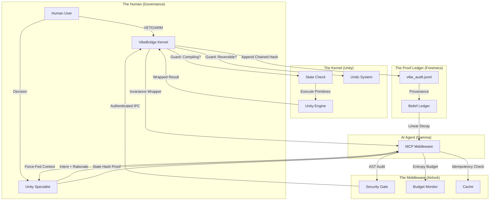

# 🗺️ Final Invariance Blueprint: The Distributed Proof System

This blueprint defines the end-to-end data flow and invariant enforcement logic for the UnityVibeBridge ecosystem. It serves as the authoritative map for auditing and preventing systemic drift.

---

## 🏛️ The Architecture of Proof

---

## 🔒 The Triple-Lock Flow

### 1. The Proposition (Pre-flight)
- **AI** sends an **Intent** (e.g., `OPTIMIZE`).
- **Middleware** checks **Entropy Budget**. If 0 → HALT.
- **Middleware** checks **Idempotency Key**. If hit → NO-OP.

### 2. The Execution (In-flight)
- **Kernel** verifies `IsSafeToMutate`. If compiling → REJECT.
- **Kernel** executes the mutation inside an **Atomic Undo Group**.
- **Kernel** captures the result, increments the **Monotonic Tick**, and wraps everything in the **Invariance Wrapper**.

### 3. The Finalization (Post-flight)
- **Kernel** appends to the **Forensic Ledger** (`vibe_audit.jsonl`), chaining the new hash to the previous one.
- **Middleware** force-feeds the **New State Hash** and **Tick** back to the AI.
- **AI** must use these specific values to "Unlock" the next commit gate.

---

## 🧪 Verification Matrix

| Challenge | Safeguard | Result |
| :--- | :--- | :--- |
| AI Hallucinates Object | **Layer 1: Reality Anchor** | Object resolution fails; `KNOWN` state becomes `UNKNOWN`. |
| AI Thrashes (Loops) | **Layer 4: Entropy Budget** | System locks after 100 operations; Human intervention required. |
| AI Retries Failed Op | **Layer 3: Idempotence** | Middleware detects `idempotency_key` collision and prevents re-execution. |
| AI Acts on Stale Log | **Layer 10: Intent Decay** | `monotonic_tick` mismatch in commit call; Gate remains LOCKED. |
| AI Forgets the Lesson | **Layer 2: Belief Ledger** | `vibe_beliefs.json` provides provenance and confidence decay metrics. |

---
**Copyright (C) 2026 B-A-M-N**
