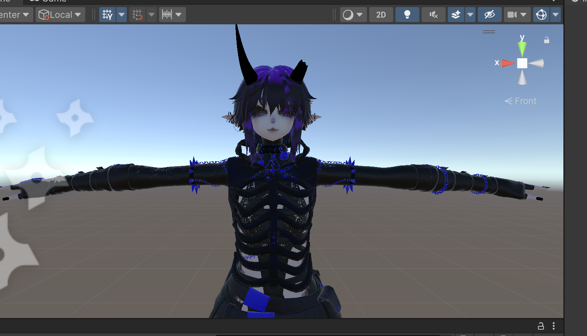
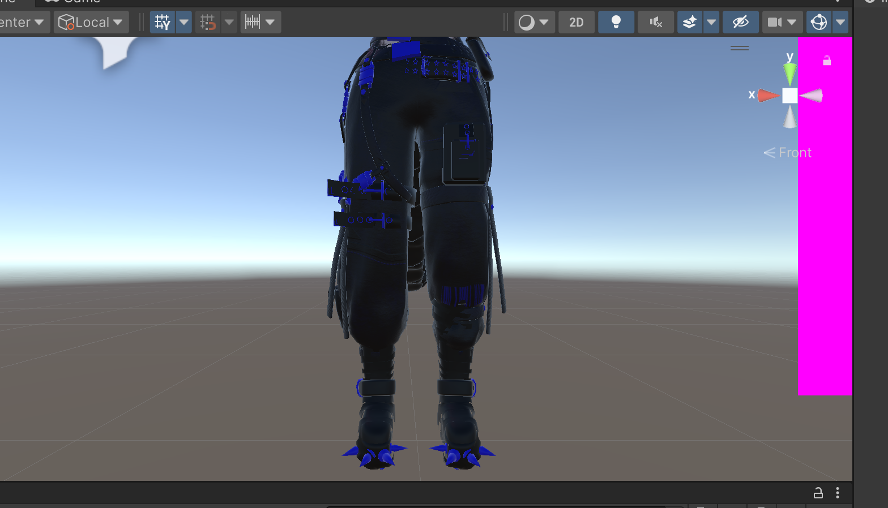

# 🌌 UnityVibeBridge

**A Unity Editor extension that enables secure, deterministic AI-assisted scene creation and editing by constraining intent execution through a guarded control kernel.**

> [!WARNING]
> **EXPERIMENTAL & IN-DEVELOPMENT**  
> This project is currently an active research prototype. APIs, security protocols, and core logic are subject to rapid, breaking changes. This software performs mutations on the Asset Database and Scene; **MANDATORY BACKUPS** are required before use.

### The "One-Click" Technical Director for Unity Editor Mastery
*A production-grade AI control interface for deterministic, undo-safe Unity Editor operations.*

**UnityVibeBridge** is a professional-grade intelligent interface that transforms the Unity Editor into a **Governed Creation Kernel**. It allows AI agents to interact safely, deterministically, and artistically with Unity’s core engine—turning natural language intents into professional production operations.

---

## 🖼️ Previews

 
 

---

## ⚠️ Read This First (Why This Exists)

**UnityVibeBridge** is not a toy, a prompt wrapper, or a "magic AI button." 

It is a **reference implementation of AI-assisted systems design** in a high-fidelity, stateful environment. It allows Large Language Models (LLMs) to safely operate inside Unity without risking project corruption, infinite import loops, or runaway execution.

This project answers a critical engineering question: 
> *How do you let an AI act inside a complex, stateful application—without trusting it?*

**The answer is: You don’t. You constrain it.**

| **Capability** | **Feature** |
| :--- | :--- |
| 🛡️ **Iron Box** | Zero-trust security via the **Kernel Guard**, Token-Auth, and AST-validated IPC. |
| ⚛️ **Kernel Integrity** | Real-time invariant enforcement (No mutations during domain reloads, atomic transactions). |
| 🏃 **Stable Lifecycle** | Time-budgeted main-loop dispatching (5ms slices) ensuring a smooth 60+ FPS. |
| 🧠 **Epistemic Control** | Truth-reconciliation tools (`telemetry`, `vibe_status`) that prevent AI hallucinations. |

---

## 🧠 What This Project Demonstrates (Technical Audit)

If you are evaluating this project as an engineer or hiring manager, this repository is a working demonstration of **AI Systems Engineering**:

*   **Control-Plane vs. Execution-Plane Separation**: LLMs generate *intent* (Mechanistic Intents), never raw code execution.
*   **Adversarial Security**: Hardened via local binding, session-token authentication, and **Recursive AST Auditing** of Python payloads.
*   **Transactional State Mutation**: Every operation is wrapped in undo-safe, atomic blocks. **One AI request = One Undo step.**
*   **Performance Budgeting**: Implements **5ms Main-Thread Time Budgeting** to ensure the Unity Editor maintains 60+ FPS even during heavy AI automation.
*   **Truth Reconciliation Loop**: Tools like `get_telemetry_errors` force the agent to verify reality against intent in a closed feedback loop.

---

## ⚡ What you can do in 5 minutes

1.  **Install**: Drag the `unity-package/` folder into your Unity project's `Assets/`.
2.  **Initialize**: Wait for compilation. The Kernel starts automatically on port `8085`.
3.  **Connect**: Point your AI agent (Claude Desktop, Goose, etc.) to the bridge using `scripts/python mcp-server/server.py`.
4.  **Create**: Ask the AI: *"Spawn a red cube at the origin and name it 'TestCube'."*
5.  **Audit**: Ask the AI: *"Run a mesh audit on my selected object and tell me the polycount."*

---

## 🚀 Quick Start (Detailed Installation)

1.  **Install**: Copy the `unity-package/` directory into your project's `Assets/` folder.
2.  **Initialize**: Wait for Unity to compile. The Kernel starts automatically on port `8085`.
3.  **Handshake**: Point your MCP-compatible AI agent (e.g., Goose, Claude Desktop) to the bridge. 
4.  **Monitor**: Open [http://localhost:22005](http://localhost:22005) to view the live **System Pulse** and **Chained Audit Trail**.

**Requirements**: 
- **Unity**: 2019.4 LTS or newer.
- **OS**: Windows, Linux, or macOS.
- **Dependencies**: None (Kernel is standalone; Payloads support optional VRChat SDK).

---

## 🔰 FOR BEGINNERS

New to AI development in Unity? Start here to understand the philosophy, safety mechanisms, and how to avoid common pitfalls like "AI Psychosis".

👉 **[Read the Comprehensive Guide for Beginners](HUMAN_ONLY/FOR_BEGINNERS.md)**

---

## 🛠️ Common AI Intents (Examples)

The AI interacts with Unity via **Mechanistic Tools**. Below are typical requests the agent can execute autonomously once connected:

| Intent | Tool Call | Result |
| :--- | :--- | :--- |
| **Placement** | `world/spawn(asset="path/to.prefab", pos="0,1,0")` | Spawns object at coordinates with Undo registration. |
| **Rig Check** | `audit/avatar(path="sem:MainBody")` | Returns mesh, vertex, and material report for the target. |
| **Automation** | `texture/crush(path="root", maxSize=512)` | Batch-downscales all textures in a single 5ms frame slice. |
| **Visual Fix** | `material/set-color(path="sem:Face", index=0, color="1,0,0,1")` | Safely changes material properties via SerializedObjects. |
| **Logic Batch** | `system/execute-recipe(tools_json="...")` | Executes multiple tools in one atomic, reversible transaction. |

---

## 🛡️ Verifiable Security & Safety

Unlike standard script-bridges, UnityVibeBridge treats the AI as an **untrusted operator**. 

1.  **Pentest Suite**: We include a `security_tests/pentest_suite.py` that tests for 48 known attack vectors.
2.  **Forensic Ledger**: Every mutation is logged to an **immutable, cryptographically chained audit log** (`vibe_audit.jsonl`).
3.  **Human Kill-Switch**: The Kernel includes a mechanical `system/veto` tool that instantly locks the creation perimeter.

---

## 🛠️ Complete Tool Reference (Exhaustive)

### 1. 🧠 Epistemic & Cognitive Governance (Anti-Hallucination)
*   **`inspect_object`**: Forces the agent to verify its assumptions about components and state.
*   **`get_telemetry_errors`**: Streams the last 50 console logs to the agent for "Truth Loop" verification.
*   **`list_available_tools`**: Dynamic discovery of installed Payloads and capabilities.
*   **Stale Session Guard**: Automatically invalidates beliefs if Unity restarts (via `sessionNonce` tracking).

### 2. 🛡️ Kernel & Integrity (The Guardrails)
*   **`transaction_begin/commit`**: Atomic Undo-Group management.
*   **`system/veto`**: Physical stop-button for all creation primitives.
*   **Kernel Guard**: Blocks mutations during Compilation or Play Mode.
*   **Time-Budgeting**: Kernel-level enforcement of 5ms execution windows per frame.

### 3. 🏗️ Scene Manipulation & Strategic Intent
*   **`get_hierarchy`**: Recursive dump of InstanceIDs and names for scene mapping.
*   **`system/search`**: High-performance Regex and Layer-based discovery for massive scenes.
*   **`rename_object` / `reparent_object`**: Precise transform and identity adjustments.
*   **`clone_object` / `delete_object`**: Managed lifecycle for GameObjects with Undo support.
*   **`select_object`**: Focus-aware "Stealth Framing" that respects the user's active viewport.

### 4. 🎨 Technical Art, surafcing & Optimization
*   **`object/set-value`**: Safe, reflection-based mutation of public fields and properties.
*   **`vram_footprint`**: Numerical analysis of GPU memory usage by textures.
*   **`texture_crush`**: Batch-downscales textures with hardware safety caps (8k max).
*   **`swap_to_quest_shaders`**: Automated material transition to mobile-safe shaders.
*   **`opt/fork`**: Creates non-destructive optimization variants with isolated material clones.

### 5. 🔗 Pipeline & Infrastructure
*   **`world/spawn`**: Safe instantiation of prefabs from the project database.
*   **`asset/rename` / `move`**: Safe filesystem operations without breaking GUID links.
*   **`export/validate`**: Checks for scale sanity, non-zero rotations, and missing scripts.
*   **`view/screenshot`**: High-speed visual feedback via Port 8085.

---

## 🛡️ Iron Box Security
The bridge is hardened via four distinct layers:
1.  **AST Auditing**: All incoming tool calls are audited by `scripts/security_gate.py` for forbidden patterns.
2.  **Token Authentication**: Port 8085 requires an `X-Vibe-Token` matching the current session.
3.  **Iron Box Protocol**: Every mutation is wrapped in atomic `Undo` groups. **One AI Request = One Undo Step.**
4.  **The Guard**: The bridge physically disables mutations if `vibe_status.json` is not "Ready".

---

## 📘 User Guides & Philosophy
*   **[Full Feature Manifest](HUMAN_ONLY/FEATURES.md)**: Authoritative list of all functional abilities and roadmap.
*   **[Technical Installation & Engineering](HUMAN_ONLY/INSTALL.md)**: Deep dive into the Kernel architecture, security, and advanced setup.
*   **[AI Philosophy & Safety](HUMAN_ONLY/FOR_BEGINNERS.md)**: Learn how to manage AI behavior and prevent "AI Psychosis."

---

## 🌐 The VibeBridge Ecosystem

UnityVibeBridge is part of a trinity of tools designed for seamless AI-assisted creation:
*   **[BlenderVibeBridge](https://github.com/B-A-M-N/BlenderVibeBridge)**: The companion kernel for high-fidelity 3D modeling and rigging.
*   **[VibeSync](https://github.com/B-A-M-N/VibeSync)**: The orchestration layer that synchronizes state between Unity and Blender.

---

## 🤝 Community & Softening the "Iron Box"

While our "Iron Box" security model is strict, it is designed to **empower** creators, not restrict them. The guardrails exist so you can experiment freely without fear of destroying your work.

**New to the project?** Don't be intimidated by the technical intensity. We welcome contributors of all skill levels. If you have an idea for a new Payload or a better way to visualize data, jump in! Our [Beginner's Guide](HUMAN_ONLY/FOR_BEGINNERS.md) and [Contributing Guidelines](HUMAN_ONLY/CONTRIBUTING.md) are there to help you navigate the Kernel safely.

---

## 🏛️ Project Doctrine & Architecture
*   **[For Hiring Managers](HUMAN_ONLY/FOR_HIRING_MANAGERS.md)**: In-depth engineering audit and systems design breakdown.
*   **[Vision & Philosophy](HUMAN_ONLY/VISION.md)**: Deep dive into the architectural goals and problem space.
*   **[Technical Architecture](AI_CONTEXT.md)**: High-level overview of the Control-Plane vs. Execution-Plane.
*   **[Non-Goals & Doctrine](NON_GOALS.md)**: The intentional limitations and philosophical guardrails of the project.
*   **[Security Threat Acceptance](AI_SECURITY_THREAT_ACCEPTANCE.md)**: Formal definition of the boundary of responsibility and residual risks.
*   **[Engineering Constraints](AI_ENGINEERING_CONSTRAINTS.md)**: The strict technical rules governing all code generation.
*   **[Failure Modes & Recovery](HUMAN_ONLY/FAILURE_MODES.md)**: Taxonomy of system failures and recovery protocols.
*   **[Contributing](HUMAN_ONLY/CONTRIBUTING.md)**: Guidelines for extending the Kernel or adding new Payloads.

---

## ⚖️ License & Legal Liability

### Dual-License & Maintenance Agreement (v1.2)
Copyright (C) 2026 B-A-M-N (The "Author")

This project is distributed under a **Dual-Licensing Model**. By using this software, you agree to be bound by the terms in the **LICENSE** file.

1.  **THE OPEN-SOURCE PATH: GNU AGPLv3**: Free for hobbyists and non-commercial research.
2.  **THE COMMERCIAL PATH: "WORK-OR-PAY"**: For revenue-generating entities. Requires **Significant Maintenance Contributions** or a **License Fee**.

**[Full Privacy Policy](HUMAN_ONLY/PRIVACY.md)** | **[Security Mandates](HUMAN_ONLY/SECURITY.md)**

---
**Created by the Vibe Bridge Team.**
